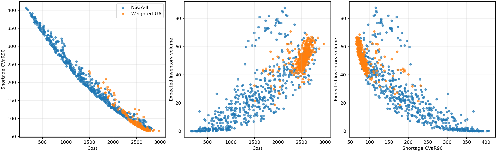

# 🧬 Лабораторная № 3 · План закупок · NSGA-II

**Python · 2026 · группа 507 · студент № 17 · вариант 16**

> Воспроизводимый эксперимент: собственные эволюционные операторы, сохранённые входные данные, реальные серии запусков и проверка корректности.



[Отчёт](REPORT.md) · [Результаты](results/RESULTS.md) · [Конфигурация](config.json) · [Проверки](docs/TEST_LOG.txt)

## Быстрый запуск

Распакуйте архив и откройте терминал **в папке этой лабораторной**. Нужен Python 3.10 или новее; выполненная проверка — Python 3.12.14. Администраторские права не требуются.

**Windows (PowerShell или cmd):**

```powershell
py -m venv .venv
.venv\Scripts\python.exe -m pip install -r requirements.txt
.venv\Scripts\python.exe -m unittest discover -v
.venv\Scripts\python.exe main.py
```

**Linux / macOS:**

```bash
python3 -m venv .venv
.venv/bin/python -m pip install -r requirements.txt
.venv/bin/python -m unittest discover -v
.venv/bin/python main.py
```

Активация окружения не нужна: команды напрямую вызывают его интерпретатор. Интернет нужен только для первоначальной установки NumPy и Matplotlib. Сам эксперимент работает локально без сети, GPU и внешних сервисов.

## Команды

Далее `python` означает интерпретатор созданного окружения.

```bash
# Полная серия: 20 seed для каждого сравниваемого метода
python main.py

# Быстрая проверка без перезаписи приложенной полной серии
python main.py --runs 1 --seed 37000 --output results_custom/smoke

# Пользовательская конфигурация
python main.py --config config.json --output results_custom/repeat

# Справка
python main.py --help
```

`--seed` — первый seed серии, далее используется `seed + номер запуска`. Одинаковые seed позволяют повторить результаты, но различия версий библиотек могут влиять на последние разряды. Для воспроизведения версий выполненной серии используйте `requirements-tested.txt`. Это фиксация двух прямых зависимостей, не полный lock-файл окружения.

## Что внутри

| Файл / папка | Назначение |
|---|---|
| `model.py` | Предметная модель и собственные операторы поиска |
| `main.py` | CLI, серия независимых запусков и визуализации |
| `common.py` | CSV/JSON, сводная статистика и графики |
| `config.json` | Параметры полной серии |
| `test_model.py` | Проверки инвариантов и воспроизводимости |
| `data/` | Сохранённые входные данные (если требуются) |
| `results/runs.csv` | Все запуски: seed, качество, время, бюджет |
| `results/summary.csv` | Минимум, среднее, медиана, std, максимум |
| `results/trajectories.json` | Исходные траектории всех запусков |
| `results/experiment.json` | Конфигурация и версии среды |
| `REPORT.md` | Полный отчёт: постановка, схема, результаты, выводы |

## Проверка результатов

Приложены **полные серии**, а не один удачный запуск. Графики показывают среднее и диапазон min–max. Подробности бюджета, направления оптимизации и ограничения выводов находятся в отчёте. Повторный запуск без `--output` перезаписывает `results/`; отчёт остаётся снимком приложенной серии.

