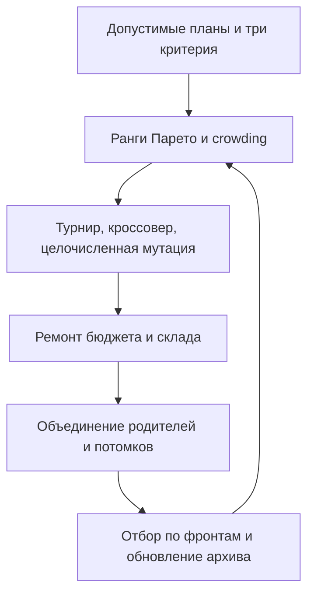
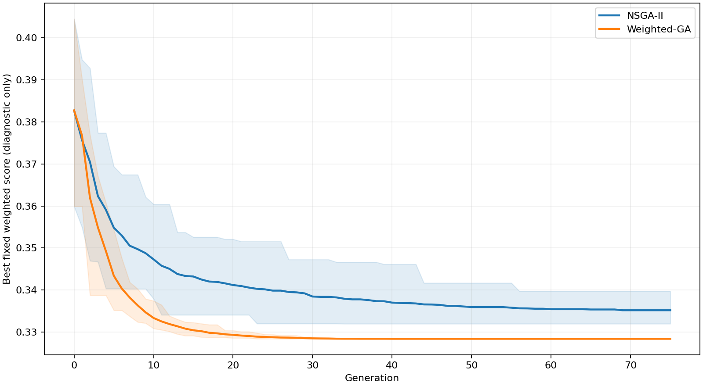

# Лабораторная работа № 3

## План закупок · NSGA-II

**Дисциплина:** «Эволюционное программирование и генетические алгоритмы»  
**Группа:** 507 · **номер студента:** 17 · **год:** 2026  
**Вариант:** `V = 1 + ((17 × 17 + 7 × 0 + 26) mod 20) = 16`.


## 1. Выбор трека и предметная модель

Выбран **трек A**, вариант 16 — план закупок. В методичке для обеих таблиц перечислены варианты 1–20, но отдельное правило выбора трека не приведено. Этот выбор явно зафиксирован; при индивидуальном назначении трека B преподавателем потребуется другая постановка.

План на один период для 12 товаров: $q_i\in\{0,\ldots,20\}$. Генотип и фенотип — целочисленные количества. Данные синтетические: seed 2650717; цены 8–34, объёмы 1–4, важность 1–4, средние спросы 5–14; 60 пуассоновских сценариев спроса с обрезанием до 20 единиц. Вся матрица спроса приложена. Это учебная сценарная модель, не реальные рыночные цены.

Жёсткие ограничения: $\sum p_iq_i\le3200$; $\sum v_iq_i\le340$. Ремонт последовательно уменьшает количества у товара с наибольшей величиной $p_i/3200+v_i/340$ среди ненулевых. Он не увеличивает ни один ограничиваемый ресурс и завершается не позднее нулевого плана.

## 2. Критерии

Минимизируется вектор:

1. Стоимость: $f_1=\sum p_iq_i$.
2. Риск дефицита: $L_s=\sum w_i\max(D_{si}-q_i,0)$; $f_2$ — среднее шести наибольших $L_s$ из 60 сценариев, то есть эмпирический CVaR на уровне 90%.
3. Объём хранения остатка: $f_3=\frac1{60}\sum_s\sum_i v_i\max(q_i-D_{si},0)$.

Увеличение закупок обычно уменьшает дефицит, но увеличивает затраты и остаток. «Риск» здесь — тяжесть неблагоприятного дефицита, **не вероятность** события. Отсутствует обязательный минимум закупки: нулевой план допустим, дешёв, но имеет высокий риск.

## 3. Собственный NSGA-II

Реализованы попарное доминирование, недоминируемая сортировка, crowding distance по нормированным соседним интервалам внутри фронта, бинарный турнир по рангу/расстоянию, элитистский отбор из родителей и потомков. Равные по всем критериям точки не доминируют друг друга; при нулевом размахе критерия его вклад в crowding равен 0. Внешний архив хранит все найденные недоминируемые точки и удаляет точные дубликаты критериев. Это **эмпирический** фронт: отсутствие найденного доминатора не означает доказанной глобальной эффективности.

Равномерный кроссовер сохраняет целочисленность; мутация добавляет одну из величин −3, −2, −1, 1, 2, 3 с вероятностью 1/12 на ген; затем применяется ремонт. Число особей 56, поколений 75, вероятность кроссовера 0.9.



## 4. Сравнение и метрики

20 seed 37000–37019, **4256 оценок планов на запуск**. Каждая оценка использует все 60 сценариев. Baseline — ГА с фиксированной взвешенной суммой:

$$S=0.25\,f_1/3200+0.60\,f_2/f_2(0)+0.15\,f_3/340.$$

Нормировка фиксирована до оптимизации и одинакова у методов. Baseline использует турнир из 3 и отбор по $S$; вариация, ремонт, начальная популяция и бюджет совпадают. Он также сохраняет внешний архив найденных точек, чтобы сравнение фронтов было осмысленным. Изменяется весь механизм отбора (это сравнение алгоритмов, а не изолированная абляция crowding).

В `summary.csv` метрика score — лучшее найденное $S$, а **не полное качество фронта**. Дополнительно приведены размеры архивов (`front_sizes_summary.csv`) и двусторонняя метрика покрытия (`coverage.csv`): доля точек одного архива, слабо доминируемых точками другого. Больший размер архива сам по себе не доказывает близость к истинному фронту. Гиперобъём и известный точный фронт не вычислялись.




Проекции показывают **заранее выбранный первый seed**, а не лучший запуск. В 2D часть точек может выглядеть доминируемой, оставаясь недоминируемой в 3D. В репрезентативных планах дешёвый минимизирует найденную стоимость, малодефицитный — риск, сбалансированный имеет лучшую заданную свёртку среди оставшихся отличных планов.

## 5. Выводы и ограничения

NSGA-II поддерживает больше различных компромиссов, но ГА со свёрткой лучше именно по этой свёртке. Это ожидаемо: NSGA-II распределяет бюджет по фронту, baseline направляет отбор в одну область. Для нескольких готовых планов на выбор NSGA-II полезен; для единственного заранее фиксированного критерия предпочтительнее соответствующий скалярный оптимизатор.

Найденные планы допустимы и отражают конфликт целей, однако глобальная оптимальность не доказана. Нулевой план не внедрялся в популяцию, поэтому даже самый дешёвый найденный план может иметь положительную стоимость. Сценарии служат единственной обучающей/оценочной моделью: устойчивость к новому распределению спроса не проверялась. Улучшения — отложенные сценарии, чувствительность к корреляциям спроса, более качественный ремонт и сравнение гиперобъёма при общей фиксированной опорной точке.

## Численные результаты выполненной серии


Минимум и максимум — значения метрики, направление оптимизации см. в отчёте. Стандартное отклонение выборочное (ddof=1). Полоса на графике — min–max, не доверительный интервал.

| Метод | Запусков | Минимум | Среднее | Медиана | Std | Максимум | Время, с |
|---|---:|---:|---:|---:|---:|---:|---:|
| NSGA-II | 20 | 0.331969 | 0.335182 | 0.334761 | 0.00223187 | 0.339746 | 0.8265 |
| Weighted-GA | 20 | 0.328383 | 0.328383 | 0.328383 | 5.69532e-17 | 0.328383 | 0.5566 |

### Три характерных плана (seed 37000)

| План | Стоимость | CVaR дефицита | Средний остаток |
|---|---:|---:|---:|
| cheap | 151.00 | 407.500 | 0.000 |
| low_shortage | 2797.00 | 69.833 | 64.517 |
| balanced | 2474.00 | 86.833 | 52.833 |

Количество единиц по товарам Item-01 … Item-12:

- **cheap**: `[0, 0, 0, 0, 2, 3, 0, 0, 4, 0, 0, 0]`.
- **low_shortage**: `[9, 12, 11, 1, 9, 17, 5, 12, 15, 11, 17, 13]`.
- **balanced**: `[9, 11, 10, 4, 9, 15, 0, 12, 18, 6, 15, 12]`.

Среднее межфронтовое покрытие: NSGA-II покрывает 6.61% точек Weighted-GA; Weighted-GA покрывает 15.36% точек NSGA-II. Ни один архив не доминирует целиком другой.

## Полная конфигурация

```json
{
  "population": 56,
  "generations": 75,
  "runs": 20,
  "first_seed": 37000,
  "mutation_probability": 0.08333333333333333,
  "crossover_probability": 0.9,
  "group": 507,
  "student_number": 17,
  "year": 2026,
  "variant": 16
}
```


